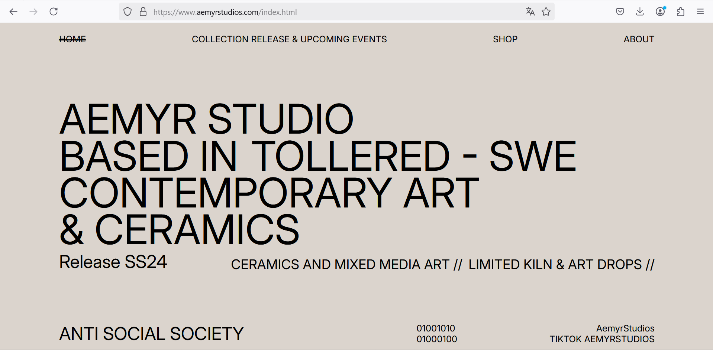
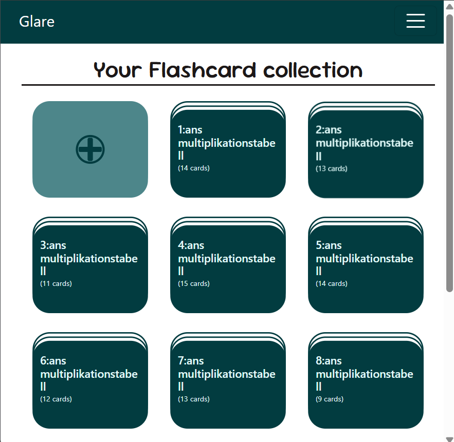
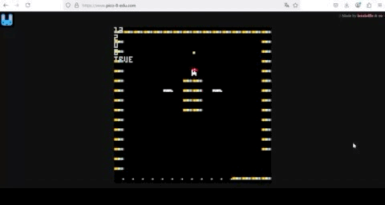

<h1 align="center">Hi, I'm Ingo</h1>
<h3 align="center" style="text-wrap:balance">I'm a developer from Sweden. I love the possibilities with programming whether it's  
  creating apps, games, websites or building my own mechatronic-projects.</h3>

---

<h3 align="left">Languages and Tools:</h3>

 

 
  
<h3 align="left">Additional Skills:</h3>

   

 
 
 

 
  

 
 
 

<h3 align="left">Connect with me:</h3>

---

<h3 align="left">Projects and fun:</h3>

|  | |
|:-------------------------------------------------:|:-------------------------------------------------:|
| [Website for the brand Aemyr Studios](https://www.aemyrstudios.com/) | Group-project done with vue.js](https://ingoelgringo.github.io/glare/) |
|:-------------------------------------------------:|:-------------------------------------------------:|
|  | |
|:-------------------------------------------------:|:-------------------------------------------------:|
| [I´m a musician at heart](https://ingoelgringo.github.io/ingo-web-synth/) | [Playing with particles inside the canvas element](https://ingoelgringo.github.io/canvasPractice/) |
|:-------------------------------------------------:|:-------------------------------------------------:|
|  | |
|:-------------------------------------------------:|:-------------------------------------------------:|
| [Me and a couple of friends are also lookin into game development in our spare time](https://www.lexaloffle.com/pico-8.php) | [Mechatronics is a new hobby of mine](https://www.arduino.cc/) |

