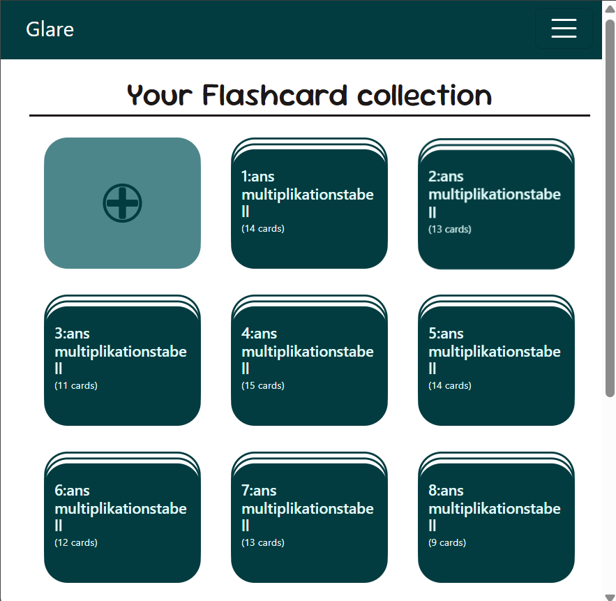
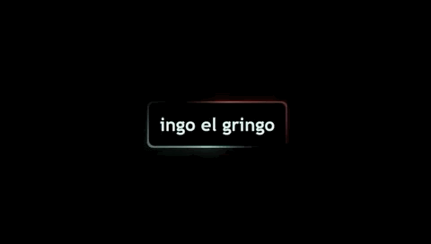
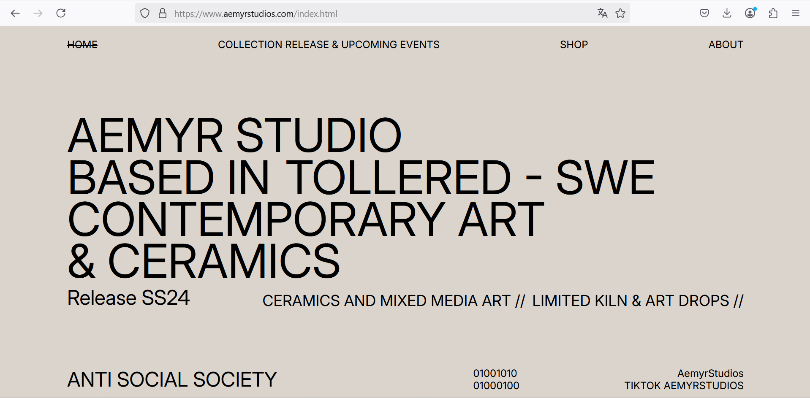
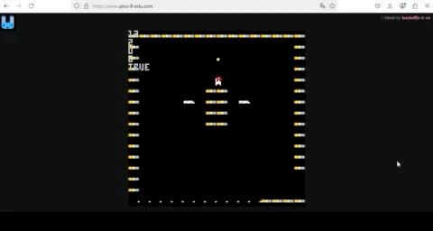

# Hej, jag heter Ingo

Jag är en fullstackutvecklare från Göteborg med fokus på TypeScript, React och Node.js.

Jag är nyexaminerad från IT-Högskolan i Göteborg där jag studerade fullstackutveckling med inriktning JavaScript. Under min praktik fick jag arbeta med loggvisualisering, backendlösningar och frontendprestanda.

Jag gillar att bygga allt från webbapplikationer till kreativa projekt inom ljud, grafik, spel och mekatronik.

---

## Projekt & Experiment

### Skolprojekt

Grupprojekt byggt med Vue.js där fokus låg på frontendutveckling och interaktiva gränssnitt.

- Vue.js

### Web Synth

Ett experiment där jag kombinerar programmering och musik genom en webbaserad synthesizer.

- JavaScript
- Tone.js
- Web Audio API

### Canvas Experiments

Experiment med partikeleffekter och animationer i HTML canvas.

- Canvas API
- Animation
- Rendering
- Visuella effekter

### Webbprojekt

Webbsida byggd under utbildningen till en keramikstudio.

- HTML
- CSS
- JavaScript

### Spelutveckling

- Pico 8
- LUA

### Mekatronikprojekt

- Arduino
- C

---

## Tech Stack

### Frontend

* React
* TypeScript
* Material UI
* Vue
* HTML / CSS / Sass

### Backend

* Node.js
* Express
* GraphQL
* Prisma
* MongoDB
* PostgreSQL

### Verktyg & Övrigt

* Git
* Docker
* Linux
* Figma
* Python

---

## Kontakt

* LinkedIn: linkedin.com/in/ingemar-berghult-300a5ab7
